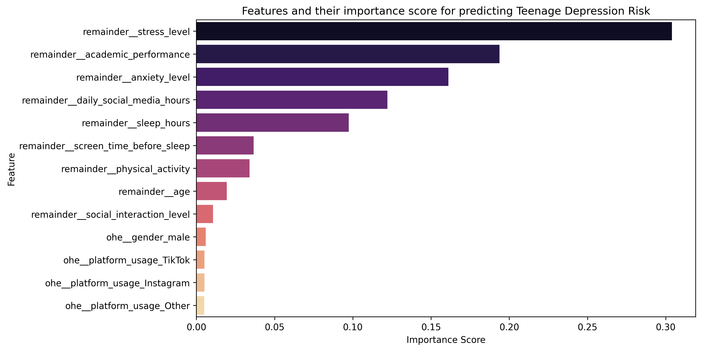
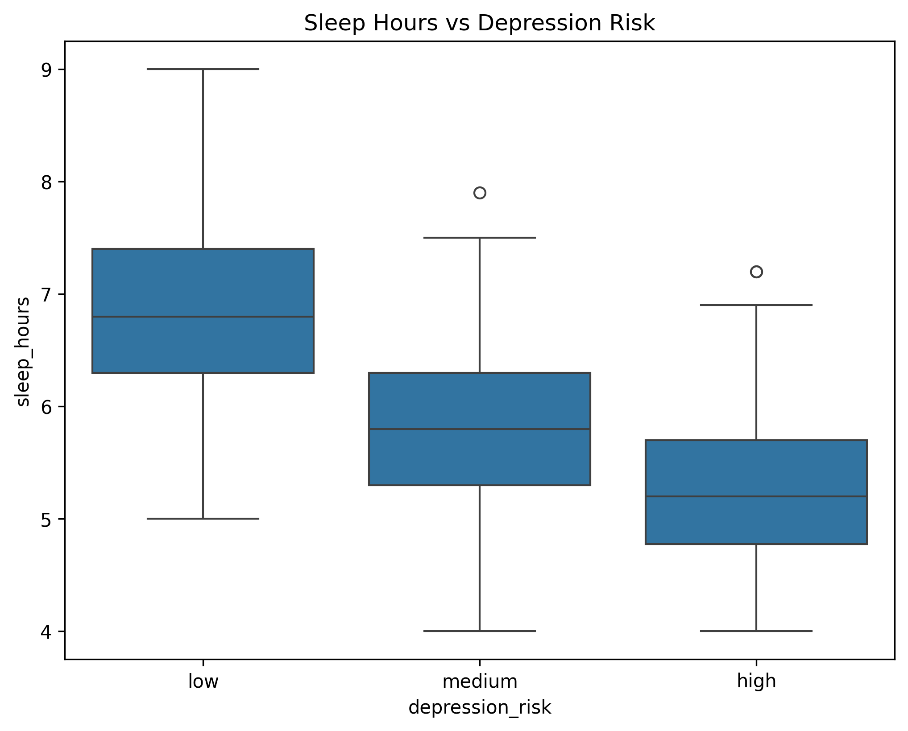
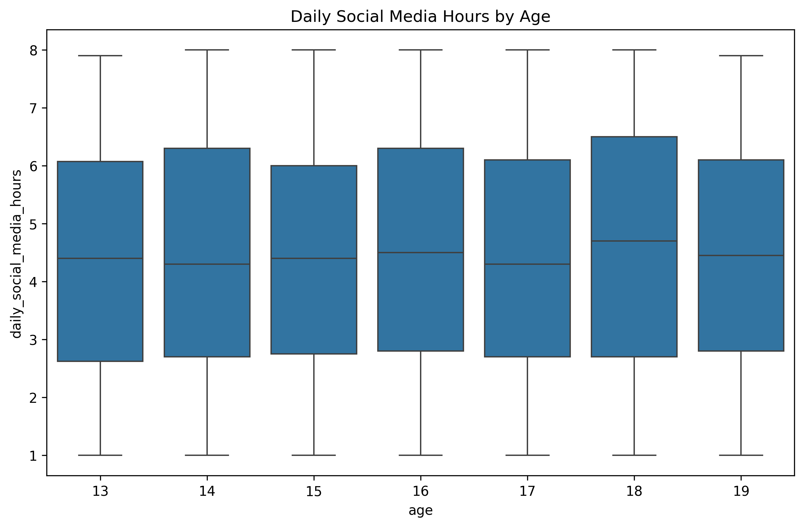
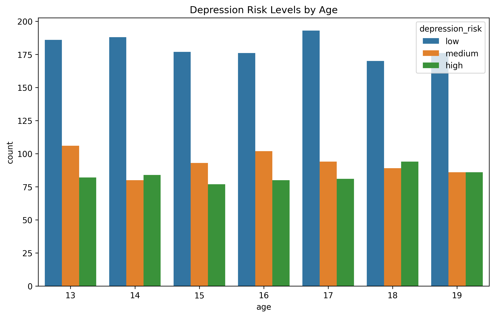
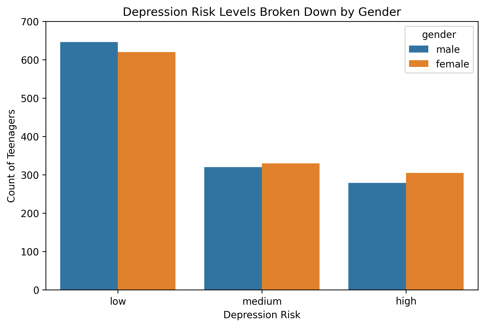
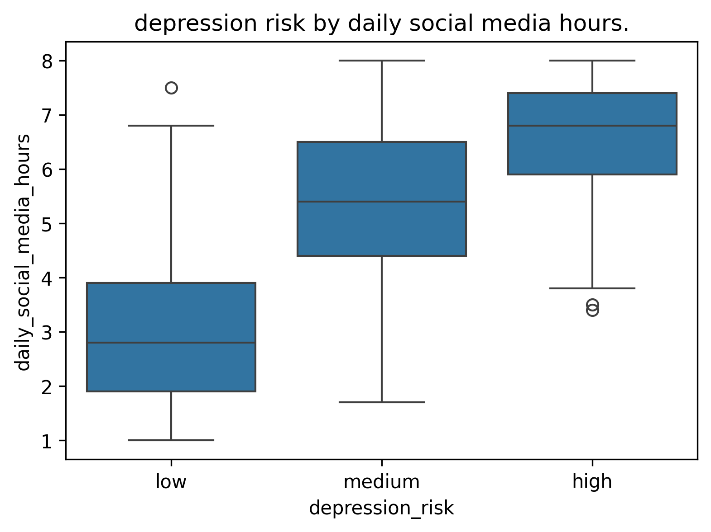

# Teen Depression Prediction ML

A Machine Learning project using Random Forest to predict adolescent depression risk with 96% recall on high-risk cases.

## 📋 Project Overview

This project implements a machine learning solution to predict the risk of depression in adolescents based on various behavioral, psychological, and social factors. The Random Forest classifier achieves exceptional performance in identifying high-risk cases, making it a valuable tool for early intervention and mental health screening.

### Key Features

- **High Recall Rate**: 96% recall on identifying high-risk depression cases
- **Random Forest Algorithm**: Robust ensemble learning method for accurate predictions
- **Comprehensive Feature Analysis**: Incorporates multiple factors affecting adolescent mental health
- **Data-Driven Approach**: Built on real-world data patterns
- **Easy to Use**: Jupyter Notebook implementation for transparency and reproducibility
- **Visual Analytics**: Extensive data visualizations for model interpretation

## 🎯 Objectives

1. Predict adolescent depression risk using machine learning
2. Achieve high sensitivity to minimize false negatives (missed high-risk cases)
3. Provide interpretable predictions for mental health professionals
4. Enable early intervention for at-risk teenagers
5. Understand key factors contributing to depression risk

## 📊 Project Structure

```
teen-depression-prediction-ml/
├── Notebook/
│   └── Teen_depression_predictor.ipynb    # Main ML model and analysis
├── data/                                   # Dataset files
├── images/                                 # Visualization plots and model results
├── models/                                 # Trained model files
├── report/                                 # Analysis reports and results
├── requirements.txt                        # Python dependencies
├── LICENSE                                 # MIT License
├── .gitignore                             # Git ignore rules
└── README.md                              # Project documentation
```

## 🔧 Requirements

This project requires the following Python packages:

- **scikit-learn**: Machine learning library for building the Random Forest model
- **pandas**: Data manipulation and analysis
- **numpy**: Numerical computing
- **jupyter**: Interactive notebook environment
- **matplotlib**: Data visualization and plotting
- **seaborn**: Statistical data visualization
- **joblib**: Saving Models.


### Installation

1. Clone the repository:
```bash
git clone https://github.com/Shahid742/teen-depression-prediction-ml.git
cd teen-depression-prediction-ml
```

2. Install required packages:
```bash
pip install -r requirements.txt
```

## 📖 Usage

1. Navigate to the project directory
2. Start Jupyter Notebook:
```bash
jupyter notebook
```

3. Open `Notebook/Teen_depression_predictor.ipynb`
4. Run all cells to see the complete analysis, model training, and predictions

### Steps in the Notebook

- **Data Loading**: Import and explore the dataset
- **Exploratory Data Analysis**: Understand feature distributions and correlations
- **Data Preprocessing**: Clean and prepare data for modeling
- **Feature Engineering**: Create and select relevant features
- **Model Training**: Train Random Forest classifier
- **Evaluation**: Assess model performance with various metrics
- **Predictions**: Make predictions on new data

## 🚀 Model Details

### Algorithm: Random Forest

- **Type**: Ensemble Learning (Supervised)
- **Task**: Multiclass Classification (Depression Risk: Low , Medium , High)
- **Performance Metric**: 96% Recall on high-risk cases

### Why Random Forest?

- Handles non-linear relationships well
- Provides feature importance scores
- Robust to outliers and missing values
- Low risk of overfitting due to ensemble approach
- Excellent for imbalanced classification problems

## 📈 Results & Visualizations

### Model Performance

The model achieves excellent performance in identifying high-risk depression cases:

- **Recall**: 96% (catches 96 out of 100 at high-risk cases)
- Minimizes false negatives - crucial for mental health applications
- Suitable for screening and early intervention programs

  ![Confusion Matrix - Random Forest].(images/confusion_matrix_tuned_random_forest.png)

### Feature Importance Analysis

Understanding which factors most influence depression risk prediction:


*Feature importance scores indicating the relative impact of each variable on depression risk prediction*

### Exploratory Data Analysis

#### Distribution Analysis

**Age Distribution:**

*Distribution of adolescent ages in the dataset*


*Age statistics and outliers visualization*

**Anxiety Level:**

*Distribution of anxiety levels among participants*


*Anxiety level statistics*

**Stress Level:**

*Distribution of stress levels across the population*


*Stress level statistics and variations*

**Academic Performance:**

*Distribution of academic performance scores*


*Academic performance statistics by depression risk*

**Sleep Hours:**

*Distribution of sleep hours among adolescents*


*Sleep hours statistics*


*Relationship between sleep hours and depression risk*

**Physical Activity:**

*Distribution of physical activity levels*


*Physical activity statistics*

**Daily Social Media Hours:**

*Distribution of daily social media usage*


*Social media usage statistics*


*Relationship between age and social media consumption*

**Screen Time Before Sleep:**

*Distribution of screen time before bedtime*


*Screen time statistics*

### Key Relationships

**Depression Risk by Age:**

*How depression risk varies across different age groups*

**Depression Risk by Gender:**

*Comparison of depression risk between genders*

**Depression Risk by Social Media Usage:**

*Correlation between social media hours and depression risk*

## 📋 Data Description

The dataset includes features related to:

- **Behavioral patterns**: Physical activity, screen time, sleep habits
- **Psychological indicators**: Anxiety level, stress level, depression status
- **Social interactions**: Social media usage, peer relationships
- **Lifestyle factors**: Sleep quality, daily routines
- **Family background**: Family history indicators
- **School/academic performance**: Academic scores and engagement

*Note: For specific feature details and data sources, refer to the Jupyter Notebook and report folder*

## 💡 Key Insights

- Early identification of at-risk adolescents is crucial for intervention
- Multiple factors contribute to depression risk - it's multifaceted
- Sleep  and anxiety show strong correlation with depression risk
- Social media usage patterns are significant indicators
- Machine learning can effectively assist mental health professionals
- High recall rate prioritizes preventing missed cases over perfect precision
- Physical activity and academic performance are protective factors

## ⚖️ License

This project is licensed under the **MIT License** - see the [LICENSE](LICENSE) file for details.

## 🤝 Contributing

Contributions are welcome! To contribute:

1. Fork the repository
2. Create a new branch (`git checkout -b feature/improvement`)
3. Make your changes
4. Commit your changes (`git commit -am 'Add improvement'`)
5. Push to the branch (`git push origin feature/improvement`)
6. Open a Pull Request

## 📧 Contact & Support

For questions, suggestions, or issues related to this project:

- Create an [Issue](https://github.com/Shahid742/teen-depression-prediction-ml/issues)
- Feel free to reach out to the project maintainer

## ⚠️ Important Disclaimer

This model is designed as a **screening tool** to assist mental health professionals and is not a substitute for professional medical advice, diagnosis, or treatment. Always consult with qualified mental health professionals for diagnosis and treatment decisions. The predictions from this model should be used in conjunction with professional clinical judgment.

## 🔍 Future Enhancements

- Incorporate additional data sources
- Explore deep learning approaches (neural networks)
- Deploy as a web application
- Develop mobile application for accessibility
- Continuous model improvement with new data
- Implementation of explainability techniques (SHAP, LIME)
- Integration with mental health platforms

## 📚 References & Resources

- Scikit-learn Documentation: https://scikit-learn.org
- Mental Health Resources: Refer to local health organizations
- Depression Information: Consult medical professionals
- Random Forest Algorithm: https://en.wikipedia.org/wiki/Random_forest

---

Made with ❤️ by Shahid Mulani
